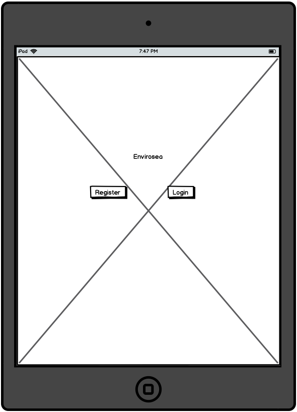
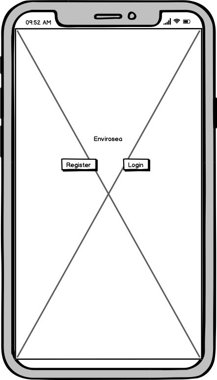
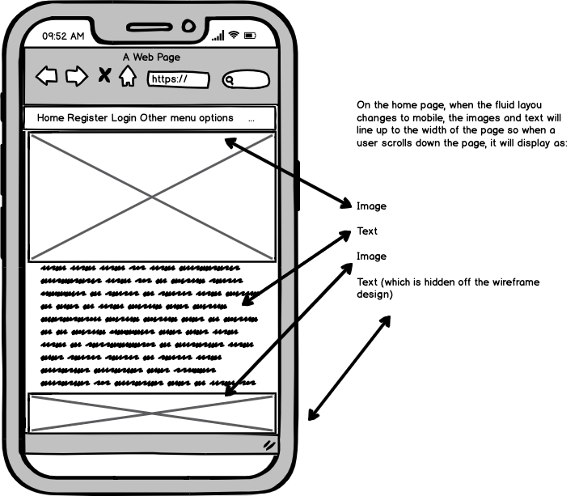

# Envirosea

  

Welcome to Envirosea. A website dedicated to preserving our oceans and helping to save all marine life. The site was developed by Matthew Lister
as the final milestone project of the Code Institute Full-Stack Web Developer Course. The website has been designed to help bring information about
the danger of plastics in the oceans and what we can do to help fight the spread and remove them altogether. 

Plastic is a killer of the oceans and in turn, the planet and we need to change this. 

Welcome to Envirosea

## Contents

### UX

* [Project Design](#Project-Design)
* [User Objects](#User-Objects)
* [Developers Objects](#Developers-Objects)
* [User Stories](#User-Stories)
* [Wireframes](#Original-wireframe-concepts)

### 2. Features

* [Site Features](#Site-Features)
* [Future Plans](#Future-plans)
* [Technologies Used](#Technologies-Used)
* [Languages](*Languages)
* [Libraries and Frameworks](*Libraries-and-Frameworks)
* [Tools](*Tools)
* [Databases](*Databases)
* [Information Architecture](#Information-Architecture)

### Deployment

* [Local Deployment](*Local-Deployment)
* [Heroku Deployment](*Heroku-Deployment)
* [Deployment](#Deployment)
* [Testing](#Testing-and-Bugs)

7. [Credits](*Credits)

* [Code Used](*Code-Used)
* [Media Used](*Media-Used)
* [Acknowledgements](*Acknowledgements)

8. [Disclaimer](*Disclaimer)

### Project Goals of Envirosea:

The Envirosea project's goal is to bring presence to the danger of plastics in the oceans and what we can be doing to prevent them. users
of the site can create an account, purchase products and add them to a shopping basket. They book trips to go cage diving or view sea Turtles.
They can use a credit card payment method and view a personal profile dashboard.

### User Goals - Products:

1. View products and review information about the product.
2. Purchase products from the online available webstore. 
3. Register an account and purchase products from the available webstore.
4. An well laid out design that's visually appealing.

### User Goals - Bookings:

1. View available trips and review information about them.
2. Book Trips from the Bookings options. 
3. Add people to the bookings.

### Owner Goals

1. User has a safe and secure e-commerce platform which is easy to use and builds revenue to help fund ocean protection.
2. Encourages users to have an interest in fighting the battle against plastic in the oceans.
3. Showcases the amazing wonders of the oceans and builds from there.
4. Helps organisations such as the WWF and Greenpeace gain wider followings.
5. Encourages users to participate in helping the oceans survive.

### User Stories

User 1 Says: "I'm so tired of seeing these issues on Sky (other TV services are available) about the state of our oceans. I wish there was a
was a way I could help in some way"

User 2 says: "I've become more aware of the planet and it's decline. Is there a website which sells products from recycleable clothing and trainers for when 
I'm running... ohh and a water bottle as well. I want to use a website online which is easy to use and well designed."

User 3 Says: "If I'm going to use this site to go Shark diving, I want the site to be secure and safe as I'm putting my personal credit card details to book this trip.
I'd also like confirmation via email and a reciept "

## User Requirements and Expectations

* When a user is shopping on the web, they need to feel that their information is protected and secure. Using a payment online needs
to be something a user feels comfortable when doing. Proper authentication ans secure payments (using Stripe for my project) is necessary
and it needs to be done with a neat and clean UX design.

### Requirements:

1. An intuitive design which is clean and appealing to the user.
2. The design looks good and functions on any device.
3. Easily add products and bookings to a shopping cart securely and safely.
4. A user can view orders in an online profile.
5. Orders can be updated, changed and removed.

### Expectations:

1. Safe storage of user details when using the website.
2. Users payment information will not be stored in the database for security reasons.
3. Dynamic design that will work on all devices.
4. Easy to naviagte when using the site and clear when using.
5. A professionally designed site which utilises all functional requests required by the project.

## Project Design

* When designing the website, I thought the colours associated with the ocean would be a good choice to use. The blues and greens nicely
brings the site together and compliment the images used.

### Colours 

The colour palette below displays the core content colours of the site. Based around an aqua design colour palette, I feel this
contains the overall colour choices of the site.

  

* In all colour palettes, there are pairings that work well together. Simple colours that can add more to a design then on their own. 
I've chosen a theme of predominantly blue, green and white. Blue to focus and tie in with the colour of the ocean and white because
it's clean. A grey font colour sits nicely between the two and stands out nicely on the pages. The images themsleves, frightening 
and stunning showcase the changes we need to make. The videos are all from vimeo and help to aid the design of the site.

* My wireframes have a general layout for the pages and the inital template for my design. I looked at other sites with a similar theme to get an understanding of what my design would benefit from.
Going in to this with fresh eyes, I was able to pick out things I believed would work and put together a design that looked good on 
all screen sizes.

### Envirosea Design choices

* The design of my website was designed with the colours of the ocean in mind. Blue's, Green's and "Aqua" we're what I envisioned
when I started working on the project. 

### images

* The images I've chosen for the site are used to show the destruction of the oceans but... on the other side, there are the images
which show the pure wonder and the beauty of the sea. I feel that if someone is going to use this website as an informative source
of our oceans disaster areas, it needs to show whats happening and what we're fighting for.

* We are lucky that talented photographers dive into the depths of the ocean and take high definition photos of marine life.
Those photographs can showcase stunning colour, light and allow us to enjoy some truly amazing colours of fish and plants. 
But, we also have to see the other side and so my images are used to show everything that the site needs to say. This is to aid the 
realisation of what we're fighting for.

### Font's Used

### Wireframes and concept drawings

  

  

  

  

  

### Information Architecture

* To develop the project, I used sqlite3 which is the database installed as part of Django. For the deployment itself, a PostgreSQL database is an add-on provided by the Heroku platform.

* The user model was also provided by Django as part of the defaults: django.contrib.auth.models.
For more information about the authentication system Django uses, [click here](https://docs.djangoproject.com/en/3.0/ref/contrib/auth/)

### Data Modelling:

* Development of the Envirsoea was developed using sqlite3 that is installed as part of the Django Framework.

* The database used is a Postgres SQL database which is hosted and provided by Heroku. Both products used allowed me to publish my data
using these and also the Allauth secure software.

### Profile Model

|Name     | DataBase Key | Field Type | Validation |
| ----------- | ----------- | -----------| ----------|
| Full Name  | user |CharField| <max_length=50,_null=False,_blank=False> |
| Phone Number | <profile_phone_number> |CharField| <max_length=20,_null=False,_blank=False> |
| Address Line 1  | <profile_address_line1>|CharField| <max_length=80,_null=False,_blank=False> |
| Address Line 2  | <profile_address_line2>|CharField | <max_length=80,_null=True,|blank=True> |
| Town/City | <profile_town_or_city>     |CharField | <max_length=40,_null=False,_blank=False> |
| PostCode  | <profile_county>     | CharField | <max_length=20,_null=True,_blank=True> |
| County  | <your_stripe_secret_key>     | CharField | <max_length=80,_null=True,_blank=True> |
| Postcode  | <profile_postcode>     | CharField | <max_length=20,_null=True,_blank=True> |
| Country  | <profile_country>     | CharField | <blank_label='Country_*',_null=False,_blank=False> |

### Products Model

|Name     | DataBase Key | Field Type | Validation |
| ----------- | ----------- | -----------| ----------|
| Category | <ForeignKey_'Category'> | <null=True,_blank=True,_on_delete=models.SET_NULL> |
| Sku |  sku | <CharField> | <max_length=254,_null=True,_blank=True> | 
| Name | name | CharField | <max_length=254> |
| Description |description | <TextField> | <max_length=800> |
| Has_Size | has sizes | <BooleanField> | <default=False,_null=True,_blank=True> |
| Price | price | <DecimalField> | <max_digits=6,_decimal_places=2> |
| Rating | rating | <DecimalField> | <max_digits=6,_decimal_places=2,_null=True,_blank=True> |
| Image_Url | image_url | URLField | <max_length=1024,_null=True,_blank=True> |
| Image | image | <ImageField> | <null=True,_blank=True>

### Categories Model

|Name     | DataBase Key | Field Type | Validation |
| ----------- | ----------- | -----------| ----------|
| Name | <name> | <CharField> | <max_length=254> |
| Friendly_name |<friendly_name> | <CharField> | <max_length=254,_null=True,_blank=True> |

### Bookings Model

|Name     | DataBase Key | Field Type | Validation |
| ----------- | ----------- | -----------| ----------|
| Trips | <ForeignKey_'Category'> |<null=True_blank=True_on_delete=models.SET_NULL> |
| Sku |  sku | CharField | <max_length=254,_null=True,_blank=True> | 
| Name | name | <CharField>| <max_length=254> |
| Description |description | TextField | <max_length=800> |
| Has_People | has_people | BooleanField | <default=False,_null=True,_blank=True> |
| Price | price | DecimalField | <max_digits=6,_decimal_places=2> |
| Rating | rating | DecimalField | <max_digits=6,_decimal_places=2,_null=True,_blank=True> |
| Image_Url | image_url | <URLField> | <max_length=1024,_null=True,_blank=True> |
| Image | image | <ImageField> | <null=True,_blank=True> |

### Checkout App

### Order Model

 |Name     | DataBase Key | Field Type | Validation |
| ----------- | ----------- | -----------| ----------|
| Order_Number | <order_number> | <CharField> | <max_length=32,_null=False,_editable=False> |
| User_Profile | <user_profile> | <ForeignKey> | <UserProfile,_on_delete=models.SET_NULL,_null=True,_blank=True,_related_name='orders'> |
| Full_Name  | <profile_full_name> | <max_length=50,_null=False,_blank=False> |
| Email | email| <EmailField> | <max_length=254,_null=False,_blank=False> |
| Phone_Number  | <profile_phone_number> | <CharField> | <max_length=20,_null=False,_blank=False> |
| Address_Line_1  | <profile_address_line1>| <CharField> | <max_length=80,_null=False,_blank=False> |
| Address_Line_2  | <profile_address_line2>| <CharField> | <max_length=80,_null=True,|blank=True> |
| Town/City | <profile_town_or_city>     | <CharField> | <max_length=40,_null=False,_blank=False> |
| PostCode  | <profile_county>     | <CharField> | <max_length=20,_null=True,_blank=True> |
| County  | <your_stripe_secret_key>     | <CharField> | <max_length=80,_null=True,_blank=True> |
| Postcode  | <profile_postcode>     | <CharField> | <max_length=20,_null=True,_blank=True> |
| Country  | <profile_country>     | <CharField> | <blank_label='Country_*',_null=False,_blank=False> |
| Delivery_Cost | <delivery_cost>| <DecimalField> | <max_digits=6,_decimal_places=2,_null=False,_default=0> |
| Order_Total| <order_total> | <DecimalField> | <max_digits=10,_decimal_places=2,_null=False,_default=0> |
| Grand_Total| <grand_total> | <DecimalField> | <max_digits=10,_decimal_places=2,_null=False,_default=0> |
| Stripe_Pid| <stripe_pid> | <CharField> |  <max_length=254,_null=False,_blank=False,_default=''> |

### Design Features 

## Features Developed for the site

A video playing background for the landing page which contains links to the producs and booking page.

Account creation, The user can login to view orders on their personal profile dashboard.

A user can update their details within the profile dashboard.

A search bar that returns a list of products available to purchase.

A search bar that returns a list of trips available for the user to book.

An individual descriptive page for each product and booking so the user can find more information.

An active shopping cart that users can update live. The features to add or remove items  to change the quantities or person amounts.

Users can take the cart of items or bookings and checkout using the secure Stripe API system. This will process the payment details and place an order.

Users can send a message via the contact form on the contact page via email.

## Future features to develop:

* An interchangeable video background for each page.
* More bookings available so users can do more.
* A volunteers program that will help users to become involved in local activities such as beach clean up's.
* Discussions with other recycling product manufacturers to build the portfolio or products.

### Technologies Used

* [HTML](https://developer.mozilla.org/en-US/docs/Web/HTML)
* [CSS](https://developer.mozilla.org/en-US/docs/Web/CSS)
* [JavaScript](https://www.w3schools.com/js/)
* [JSON](https://www.json.org/json-en.html)
* [Python](https://www.python.org/)

### Frameworks and Libraries

* [Django](https://www.djangoproject.com/)
* [Flask](https://flask.palletsprojects.com/en/1.1.x/)
* [Bootstrap](https://getbootstrap.com/docs/4.3/getting-started/introduction/)
* [Google Fonts](https://fonts.google.com/) 
* [Favicons](https://www.favicon.cc/)
* [Github](https://www.github.com)
* [Heroku](https://www.heroku.com)
* [SCSS](https://sass-lang.com/)
* [Stripe](https://stripe.com/gb/payments)
* [GitPod](https://www.gitpod.io/)
* [Gunicorn](https://pypi.org/project/gunicorn/)

### Databases

* [PostgresSQL](https://www.postgresql.org/) - Production Database
* [SQLite3](https://www.sqlite.org/index.html) - Development Database

### Project Goals

* Envirosea has been designed for the soul purpose of changing the planet. As a life support to Earth, we must protect our oceans. 97% of
the worlds water is held by the ocean and provides us with so much. It regulates our climate, absorbs CO2 and provides us with sustainable
resources. My goal is for this to become a mainstream site and help change the planet.

* For me as a developer. Creating this site has:

1. Really opened my eyes to the amazing work that can be created with a heavy duty framework. Django as the next logical step from Python is
clever, well built and robust and showcases what can be achieved as a full stack developer.

2. Made me think more about the environment, what we're doing and what can we do to help. I want a user to feel the same and to use this 
site to help re-shape the future of our ocenas and the planet.

3. Hopefully started something. I want the site to grow a following and to help the ongoing fight of protecting all marine life. We can't 
ignore what we're doing and I want to be able make a difference and using the internet and this site is a good place to start.

4. Helped me to understnad more about the state of the world. I hope this site becomes a reality and people can learn and help develop changes
to fight the threat of plastics and prevent more danger to our oceans.

* Envirosea Data Models

### Planning & Testing:

* Using new technologies on a project is sometimes daunting and so planning was of high importance to make sure everything went as 
smoothly as possible. Using new frameworks, API's and new programming languages was a learning curve and so I had to make sure to
study and follow the course material in depth. Envirosea brought some interesting challenges but I found it to be the most rewarding
and most poweful work I've produced. Django as a framework has opened my eyes in regards to what else I can achieve and I shall be using
it for many projects going forward.

* Wireframes are always a good base to start your project. Putting them together starts the project in your mind on how you can layout the frontend
design of the site for multiple devices. These are some early conecpt drawings I started with before moving onto the layout of the pages with wireframes
design.

* I also used a Kanban board to work out an early version of features and necessties in the site. Which then grew to this Flow Chart.
And then became an even bigger project but these steps started me off on the path to developing the project and design of the site. I 
then worked on each phase by working on the plan, testing and noting the results.

## Product List Page

#### Plan: 

An e-commerce site is an online shopping experience and so needs available products or sale items. Users can browse through the 
products that the business has to offer. I spent a great deal of time sourcing materials made from recycled poducts as I wanted this
to be an enviormentally specific site. Time went into the layout of the home page as it's a focul point for the site. The products 
themselves and the layout was relatively straightforward as a template but showcases the products neatly and efficiently. I wanted to 
include the same level of design with the bookings page for consistency without making the site overloaded.

#### Method: 

Once I had setup the products and bookings models, I migrated the tables into the database and I could then create 
the view within the products and bookings applications that uses a GET request to talk to the database returning the products and 
bookings into the products variables. This is then available at the front end via the 
return statement meaning I could loop through the products in the database. This would then render the information using 
Djangos template language in the HTML.

#### Testing: 

Testing that the feature worked, I navigated to both products.html and bookings.html page to see each product/booking in the database had been rendered into the HTML.

#### Outcome: 

All products and bookings displayed correctly on the front end pages.

#### Plan: 

Each product and booking needed a more informative page which held more information to what each item was about. As I was using branded products, I didn't include names for copyright purposes and so I had a short description about what the product was made from or what the booking was about such as cage diving or diving with Turtles. These pages would also include the options to add more quantity to a purchase or more people to a booking.

#### Method: 

Using the primary Key of the product or booking (primary key within the database), via the URL meant that I was able to select a product from the database when the product is chosen by the user, this allowed me to build up a page with the products only selected by the user.

#### Testing: 

To test this option I navigated to the product list page, selected any product available to see if the item and information would load on the page. I checked the url to see what ID was correct against it's JSON data equivalent and the database information which meant it was all working.

#### Outcome: 

The page displayed as expected with the correct product or booking information. I could then up the quantity of the item or find out more about the product/ booking and add the item to a cart.

### Testing the Bag (add-to, edit-bag, view-bag)

#### Plan: 

As mentioned before, an e-commerce website needs a functioning shopping bag and so planning and testing for this feature was important. The bag had to be available to view throughout the shopping experience whether user was signed in or not. More people can use the site even without entering their personal information and so they're not "tied in" just to browse. but, if they do sign in, gathering session information is an important part of e-commerce site as it helps build brand awareness and indicates how the store is operating with growth and other factors.

#### Plan: 

A context.py file was needed to function within the bag application and also needed to be included within the context processor section within templates in the settings.py file. This tells the app what the bag should look like and what information is available to it. This is also required as the bag is not stored in the database, it is stored in the session. Once done, I put the view function together so Adding to the bag, Editing the quantity in the bag, and Viewing the bag contents was available.

#### Testing: 

To test these features I did the following:

1: Navigated to the products and booking list pages and checked the product detail and booking details pages. I added items to the bag and saw the total of the bag add up as hoped.
2: Then, I waited to see if the returned page was a new version of the bag.html page with products and bookings showing as expected with each change.

#### Outcome: 

The website correctly changed as I edited the contents during the session. The bag.html page displayed correctly with each change as I edited the quantity of the contents Using the Update and Remove buttons. The bag page automatically reloaded correctly as expected to show the correct items remaining in the cart.

## Checkout (using the STRIPE API)

#### Plan: 

Being able to buy and checkout products on an e-commerce is the most importand part and a requirement. Users have to feel comfortable and have an expectation that the website they are using will securely handle their sensitive information with the highest of care and conform to strict legal guidelines. As a major feature within the project, it needed to work seamlessly and inform the user at each stage during the payment process.

#### Method: 

Using the course material supplied by Code Institute aswell as the Django & stripe documentation, I produced the Order and OrderItem models in the checkout app and peformed migrations which setup the tables in the database. Once done, I could then create the views and forms needed allowing the customer to input their personal details and process their orders. Once I had finished building these, I then setup validation required by STRIPE in a stripe.js file which handled the creation of the stripe_id. This is required in order to process a payment with the API.

#### Testing: 

To test the checkout feature, I needed to add products to the bag, then go to the checkout.html page and enter dummy contact information. I used stripe test card details (available on the STRIPE website) to attempt to create a purchase. I tested the feature with incorrect payment information on purpose to create an error message to make sure they were both visible and clear to flag a warning for the user, again, keeping them informed throughout the process.

#### Outcome: 

The payment was processed and checking the stripe dashboard, I could see stripe had processed the dummy payment for the products or bookings inside the bag.

## Profile Dashboard (orders & edit account information)

#### Plan: 

I wanted a profile section in which a user can access information about items they had purchased, and orders they had made. The user can also edit information about themselves.

#### Method: 

To implement this feature I had the Order and OrderItem model in the checkout app so each order in the database is looped through which pulls out the orders matched to the logged in users id, then within the template looping over each order.item to render the order in the dashboard. In terms of editing the user details, I had to create a form that would update the user details in the User table based on the information inputted.

#### Tesing: 

To test the orders section of the profile dashboard. I placed dummy orders from the products on the site and followed through the process until I got to the final order form on the website. This showed that my information was stored in the database and rendered on the webpage. I then checked to see if I could edit information associated with the account information section.

#### Outcome:

Changes made worked as expected and information changes updated within the database.

## Search Bars for products and bookings

#### Plan: 

I wanted to develop a search feature for the website that could be used for both functions of the site but I was unable to work it out in time so there are seperate search options but, these are different options within the site. As the site builds, more trips and more products would be added so keeping them separate I believe works better anyway. A user could search for products or bookings using data from the JSON files. This is an expected feature in an e-commerce sites so was a necessity of the site and a priority in my user stories.

#### Method: 

I created a view in the search applications that fetches a product or available trip depenedent on which search box is used and based on the query collected by the search form. The products or bookings returns multiple results based on the 'word' searched for so it users the word as the reference and ties anything with that word into the result. Using an if statement to return a 'no-results' page was also designed in case a users word choice wasn't included in any of the products or bookings descriptions or name or costings.

#### Testing: 

To test the search functionality I inputed various search queries into the search bar and hit enter. Searching for non existing products and words displayed the correct 'No results' option and all options with infomation in regards to the search dislpayed an available product or booking.

#### Outcome: 

Searching for yellow would include all products with Yellow in it. Be that a bag, coat, dress etc. Same for sun which would included sunglasses, sunshine etc. The same for bookings if I searched for cage, sea, shark.

## User Authentication (register, login, logout)

#### Plan: 

Any e-commerce website needs to allow users to create an account, login and logout. They can then view relevant information for their account and any orders which may have placed. Using the django.auth settings this feature would be heavily supported by the existing functionality that comes with django as part of it's inbuilt functionality.

#### Method: 

User tables exist in django as standard, So all I had to do was construct forms and views in order which allow the user to register an account, login to their account and logout from their account simply and easily.

#### Testing: 

To test the User features I had to perform each view step by step, First I Created a 'test-account' and checked that the records had been added to the database, Then I attempted a login to the website using those details, after that I logged out of the account using the logout view.

#### Outcome: 

A 'test-account' I created was displayed in the database, and when attempting to login to the account I was redirected to the profile page. Finally logging out cleared that session and so I would have to log back into the test-account to return to the profile page.

### Deployment

### Software Deployment and Software Cloning Technologies Used:

* This project was developed using the GitPod IDE (Integrated Development Environment) software. The data was then pushed to GitHub also using the GitPod IDE.

* The project was regularly pushed to the GitHub repository  and published to GitHub and Heroku pages using GitPod commands. Please read the guides below.

* First, I used the following as pre made template base for my site provided by Code Institute: 

GitHub Full Template Used as part of the process including software extensions for GitPod [Gitpod-Full-Template](https://github.com/Code-Institute-Org/gitpod-full-template)

* The site is hosted via the [Heroku](https://www.heroku.com/) cloud platform. Static files and uplaoded images into an online media location to create URL's was done using the 
AWS S3 Basket within the [Amazon_Web_Services_AWS](https://aws.amazon.com/)

### Deployment to Github

### When deploying Envirosea from the [GitHub repository], I used the following process:

### Deployment

### To run the project locally

* To run this project within your own IDE such as GitPod, Visual Studio or PyCharm, you'll need the following installed on your machine as they are necessary tools needed for the sites creation:

[PIP](https://pip.pypa.io/en/stable/installing/) Is a standard package management system used to install and manage software packages specifically written in Python.

[Python3 (Mine is MAC SPECIFIC)](https://www.python.org/downloads/mac-osx/) Prerequisites for installing Python3 on MAC

[Git](https://gist.github.com/derhuerst/1b15ff4652a867391f03) was the IDE I used to create my project.

1. Open the GitHub dashboard and locate the repository

2. Under repository name, select the "Clone or download" green button located to the right of the page.

3. Select the "clipboard icon" on the right hand side of the page to copy the URL of the clone.

4. In your own IDE, open a terminal window.

5. Change the current working directory to your location of choice where you'd like the directory to be made.

6. Paste your Git URL which you copied and click "OK".

7. Then Press Enter and your local clone will be created.

For more information [GitHub_Help_Page](https://docs.github.com/en/github/creating-cloning-and-archiving-repositories/cloning-a-repository)

8. In your local IDE, you will need to enter the environment variables by doing the following:

    * Click on your profile image in the top right hand corner and select 'Open Access Control' which will take you to the homepage.

    * Click on the downard facing arrow to the right of your profile image and choose 'Settings' from the menu and this will take you
    to the environment variables page. The information is displayed here but hidden within the project for security reasons.
    In this location, you will enter the stripe security keys provided by their settings when you create an account and follow the processes.

    * The following information within your settings.py file is the stripe key settings. These works in tangent with the environment variable settings:

    import os  
    os.environ["DEVELOPMENT"] = "True"    
    os.environ["SECRET_KEY"] = "<Your Secret key>"    
    os.environ["STRIPE_PUBLIC_KEY"] = "<Your Stripe Public key>"    
    os.environ["STRIPE_SECRET_KEY"] = "<Your Stripe Secret key>"    
    os.environ["STRIPE_WH_SECRET"] = "<Your Stripe WH_Secret key>"    

Stripe is being used to handle credit card payments and is an extremely useful tool to use and understand. For more information about
how it works and managing API Keys, please head over to the following site for more information [Stripe](https://stripe.com/docs/keys)

9. You will then need to install all required modules found in the requirements.txt file by using the following command:

pip -r requirements.txt.
   
10. You will then need to create the DataBase in the terminal of your IDE so you can migrate information to the DataBase. You will need to
do this when you are migrating new information to your AllAuth DataBase.

* Firstly, to make sure there are no errors, do a dry run in the terminal@

python3 manage.py makemigrations --dry-run

If no changes, run:

python3 manage.py makemigrations

These command prepare the migration and then run:

python3 manage.py migrate

11. You then need to load your JSON data fixtures/ files into the AllAuth DataBase. The JSON file includes the SKU, categories etc and 
this determines your products on the front end. Ratings, pricing and other details is produced in here.

Load the data fixtures(categories, products, Bookings, Trips) in that order into the database using the following command:
python3 manage.py loaddata <fixture_name>

12. You will then need to create a SuperUser who will have access to the admin panel. Follow the instructions to create this information
and create your username, email and password (needed twice for confirmation). 

To do this, use the following command in the IDE Terminal:

python3 manage.py createsuperuser

13. You can then run your application using:

python3 manage.py runserver

This will then load up your website/application. To view the admin panel, add /admin at the end of the URL and log in with your
SuperUser credentials.

### Back to Heroku Deployment (Windows Deployment is different and explained within the course)

To deploy Envirosea to Heroku, I used a Linux based system as I have an Apple MacBook Pro laptop.

1. I had to download and install the Heroku CLI software and run: brew install heroku from the command line. This makes it easier to create and manage the Heroku application direct from the command line.

2. I had to create a requirement.txt file using a terminal command: pip freeze > requirements.txt.

3. Then, I had to add to create a Procfile using the following command: web: envirosea.wsgi:application

4. I then pushed the files to GitHub doing the following:

git add . (The full stop includes all file that have been changed and adds them to be committed)
git commit (Named commit) which adds the requirements and Procfile to GitHub. 
Then using the git push command, it updates to my GitHub repository.

## The next stage pushing to Heroku

### We know the commits push to GitHub but I need the commits I make to reflect within Heroku and so to do this, I have to create a new Heroku application by doing the following.

Firstly, other applications which need to be installed for Heroku deployment are: 

gunicorn (WSGI HTTP Server)
dj-database-url for database connection
Psycopg (PostgreSQL driver for Python). 

I have these installed in this project and the information can be found in the requirements.txt file.

1. Create an account and log into the Heroku website. Then, Create a new app by clicking the "New" button in the dashboard. 
You need to name the application so I gave mine the same name as the application I'm creating and then set the region to Europe.

2. On the Heroku dashboard, you'll see Deploy. You need to click on "Deploy" > "Deployment method" and select Github. 

3. Confirm the linking of the Heroku app to the correct GitHub repository. This ties the two applications together.

4. Once done, you'll need to add the settings to tie Heroku in with Github. Do this by going Resources tab in Heroku, then in 
the Add-ons search bar look for Heroku Postgres(you can type postgres), select Hobby Dev — Free and click the Provision button to add it to your project.
Within the Heroku Settings click on Reveal Config Vars.

5. Set the config variables as follows (bear in mind this information is the same as the AWS secret keys from earlier)

| Key     | Value |
| ----------- | ----------- |
| AWS_ACCESS_KEY_ID  | <your_aws_secret_key>       |
| AWS_SECRET_ACCESS_KEY   | <your_aws_secret_access_key>     |
| DATABASE_URL  | <your_postgres_database_URL>     |
| EMAIL_HOST_PASS  | <your_email_password(generated_by_Hotmail)>       |
| EMAIL_HOST_USER  | <your_email_address>        |
| SECRET_KEY  | <your_secret_key>     |
| STRIPE_PUBLIC_KEY  | <your_stripe_public_key>     |
| STRIPE_SECRET_KEY  | <your_stripe_secret_key>     |
| STRIPE_WH_SECRET  | <your_secret_wh_key>     |
| USE_AWS  | <True>     |

 6. Back in the Heroku dashboard, click the "Deploy" button.

 7. In the Manual Deployment section of the page, make sure you have the master branch selected. Now click "Deploy Branch".

 8. Your site has now been deployed successfully.

 9. Copy DATABASE_URL's value(Postrgres database URL) from the Convig Vars and temporary paste it into the default database in 
 settings.py. Comment out the current database settings code temporarily add the following to settings.py:
  
  DATABASES = {     
        'default': dj_database_url.parse("<your Postrgres database URL here>")     
    }

THIS SHOULD NOT BE COMMITTED TO GITHUB FOR SECURITY REASONS

* Make sure not to commit your changes to Git whilst your URL is in the settings.py file.

10. Once this is done, you then migrate the database models to the Postgres database using the same commands as above in the terminal:

python3 manage.py makemigrations --dry run (for testing)

python3 manage.py makemigrations (To deploy if no errors)

python3 manage.py migrate (To push the data across)

11. Load the data fixtures(categories, products, Bookings, Trips) into the Postgres database using the following command:
python3 manage.py loaddata <fixture_name>

12. Again, you need to create a superuser for the Postgres database using the same settings as above:
python3 manage.py createsuperuser

13. Then remove your Postgres URL database from the settings and uncomment the default DATABASE settings code in the settings.py file.
Note: for production you'll add the environment variable 'DATABASE_URL' from the Heroku Config Vars and use Postgress database, 
but for development you need to use the SQLite as a default database.

14. Once done, add your Heroku app URL to ALLOWED_HOSTS in the settings.py file. 

15. You can connect Heroku to GitHub to automatically deploy 
each time you push to GitHub from the terminal command line. To do so, you need to go to the Heroku 
dashboard and carry out following the steps:

16. Go to: Deploy section -> Deployment method -> select GitHub and
link the Heroku app to your GitHub repository for this project.
-> click Enable Automatic Deploys in the Automatic Deployment section
-> Run git push commands in the terminal as normal, this would now deploy your code to both Github and Heroku.

17. You can do the same from the terminal by doing the following:

heroku login
after adding and comitting to Git, run the following command:
git push heroku master
After successful deployment, you can view your app bu clicking Open App on Heroku platform.
You will also need to verify your email address, so you need to login with your superuser credentials and verify your email address in the admin panel. Now you will be able to view the app running!
Hosting media files with AWS
The static files for this project are hosted in WhiteNoise(all the settings are in place and will be installed with requirements.txt, you don't need to do anything). The media files that will be uploaded by users(product/service images upliaded by superuser) are hosted in the AWS S3 Bucket. To do so, you need to create an account in AWS and create your S3 basket with public access. More about setting it up you can read in Amazon S3 documentation and this tutorial.

### Testing

* Testing this project was relatively difficult. There were so many elements to understand and use within the project and so each stage of testing after 
implementation was of high importance. I tested locally within the project and through the live connection. I also asked for testers from Slack in the Peer Review
to see what they thought of the site. To gain an understanding of what the site did and I used their feedback to make the final touches to the site.

### Features

* Envirosea's applications are: Home, Oceans, Change, Products and Bookings.

* Each application showcases different elements of protecting the oceans. There is an option for users to book trips, purchase products and the funds
go to helping protecting the oceans on our planet.

* The Home Page has a video background playing constantly. It sit's below a header which has separate seach functions. 

  

* The video background is responsive and holds the options to visit the products store or bookings part of the site.

* The Oceans page holds information about Envirosea, what we're doing and why we're doing it. Some images of some amazing sea creatures and has a
gradient wrapper around the content.

* The Change page has information in regards to plastics in the oceans, facts about what the Oceans provide and what we can do to take care of it. 
Again, there's a gradient wrapper which holds the content and information.

### Registration and Login added for security and defensive design

The MS4 website application is required to have defensive design added so a can enter secure information. Secure information
such as credit card information and address details. Because they'll be entering such details, they must have peace of mind
that their data is secure.

The Django Allauth application was installed and added to the settings.py file which included authentication to secure users login
when accessing the database (Build on this)

### Media and Content

* The images were searched and found on Google

* All content was written by myself.

### Acknowledgements

   * I would like to thank many people that have helped me with my MS4 and my journey through the course. It hasn't been easy for me as
    I've had personal issues that have held me back. I'm very thankful for the extensions I was given and the understanding provided by
    the support staff.

### Huge Thanks

   * I'm extremely grateful to my mentor [Simen Daehlin](https://github.com/Eventyret) who has supported me throughout the entire course and has been a 
    great influence and supported me all through each project. He helped me understand better processes of my code and 
    develop better efficient industry standards. He was patient, considered some of my issues when I was struggling and helped
    me in many ways.

   * I'd like to say a huge thank you to [Anna Greaves](https://github.com/AJGreaves) for helping me, seeing my determination and helping me with my progression.

   * Thank you to [Anthony O'Brien](https://github.com/auxfuse) for checking in and helping me progress and offering his advice to keep me going.

   * Thank you to [Scott Kipp](https://github.com/ShavingSeagull) for his amazing support with some obstacles with my project.

  * Thank you as well to <b>Anna</b>, <b>Scott</b>, <b>Tim</b>, <b>Samantha</b>, <b>Haley</b> and all the <b>CI tutors</b> and <b>support team</b> who really helped me progress with the project and my entire 
  course because I wouldn't have made it without any of you.

### Disclaimer

   * The content of the Website I have produced is for educational purposes only including all images and videos.
   * The links for the Facebook and Twitter sites were added for educational use only as well
   * Information used for facts were provided by WWF and 

### For my friends currently working on their Milestone 4 projects.
*
I'm happy if youy'd like to use my readme file as a reference and guide as an example of how to write a strucured milestone project. The format will hopefully be of use to you but it is not ok to copy directly from mine for your own project.

Thank you for your understanding,

Kind Regards,

Matthew

### Disclaimer

The contents of this wesbite are for educational purposes only.